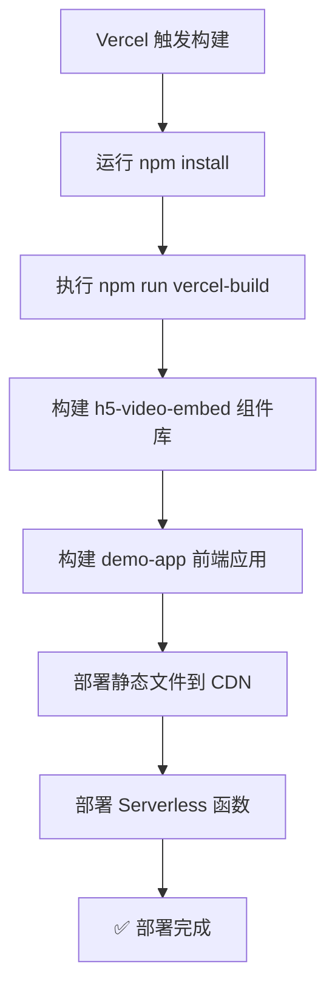

# 🚀 Vercel 部署指南

## 📋 部署概览

本项目已经为Vercel部署进行了优化配置，支持：
- ✅ **前端应用** - Demo演示页面
- ✅ **Serverless API** - 视频解析接口
- ✅ **自动构建** - 基于Git的自动部署
- ✅ **环境变量** - 灵活的配置管理

## 🎯 部署方式

### 方式一：通过Vercel CLI (推荐)

#### 1. 安装Vercel CLI
```bash
npm install -g vercel
```

#### 2. 登录Vercel
```bash
vercel login
```

#### 3. 初始化项目
```bash
# 在项目根目录运行
vercel

# 按照提示配置：
# ? Set up and deploy "D:\chaojima\cjmnpm\h5-video-embed"? [Y/n] y
# ? Which scope do you want to deploy to? [选择你的账号]
# ? Link to existing project? [Y/n] n
# ? What's your project's name? h5-video-embed-demo
# ? In which directory is your code located? ./
```

#### 4. 配置环境变量 (可选)
```bash
# 添加YouTube API密钥 (可选，提升解析质量)
vercel env add YOUTUBE_API_KEY

# 添加前端环境变量
vercel env add VITE_YOUTUBE_API_KEY
```

#### 5. 部署
```bash
vercel --prod
```

### 方式二：通过Vercel Dashboard

#### 1. 推送代码到Git仓库
```bash
# 如果还没有Git仓库
git init
git add .
git commit -m "Initial commit for Vercel deployment"

# 推送到GitHub (假设你已经创建了远程仓库)
git remote add origin https://github.com/your-username/h5-video-embed.git
git push -u origin main
```

#### 2. 连接Vercel
1. 访问 [Vercel Dashboard](https://vercel.com/dashboard)
2. 点击 "New Project"
3. 选择你的GitHub仓库
4. 配置项目设置：
   - **Framework Preset**: Other
   - **Build Command**: `npm run vercel-build`
   - **Output Directory**: `packages/demo-app/dist`
   - **Install Command**: `npm install`

#### 3. 配置环境变量
在Vercel Dashboard中设置：
- `YOUTUBE_API_KEY`: YouTube Data API密钥 (可选)
- `VITE_YOUTUBE_API_KEY`: 前端YouTube API密钥 (可选)
- `NODE_ENV`: `production`

#### 4. 部署
点击 "Deploy" 按钮开始部署。

## 🔧 配置说明

### vercel.json 配置解析

```json
{
  "name": "h5-video-embed-demo",
  "buildCommand": "npm run vercel-build",
  "outputDirectory": "packages/demo-app/dist",
  "functions": {
    "api/video.js": {
      "runtime": "nodejs18.x",
      "maxDuration": 30
    }
  }
}
```

- **buildCommand**: 自定义构建命令，构建组件库和演示应用
- **outputDirectory**: 指定构建输出目录
- **functions**: 配置Serverless函数

### 构建流程



## 🌐 API 端点

部署后，你的应用将有以下端点：

### 前端应用
- **主页**: `https://your-app.vercel.app/`
- **演示**: `https://your-app.vercel.app/`

### API接口
- **视频解析**: `https://your-app.vercel.app/api/video`

#### API使用示例
```javascript
// POST请求到视频解析API
const response = await fetch('https://your-app.vercel.app/api/video', {
  method: 'POST',
  headers: {
    'Content-Type': 'application/json',
  },
  body: JSON.stringify({
    url: 'https://www.bilibili.com/video/BV1GJ411x7h7'
  })
});

const result = await response.json();
console.log(result);
```

## 🔑 环境变量配置

### 必需的环境变量
无 - 项目可以在没有任何环境变量的情况下运行

### 可选的环境变量

#### YouTube API密钥 (推荐)
```bash
# 在Vercel Dashboard或CLI中设置
YOUTUBE_API_KEY=your_youtube_api_key_here
VITE_YOUTUBE_API_KEY=your_youtube_api_key_here
```

**获取YouTube API密钥**:
1. 访问 [Google Cloud Console](https://console.cloud.google.com/)
2. 创建新项目或选择现有项目
3. 启用 YouTube Data API v3
4. 创建API密钥
5. 在Vercel中设置环境变量

#### Vimeo访问令牌 (可选)
```bash
VIMEO_ACCESS_TOKEN=your_vimeo_access_token_here
```

## 📊 部署后验证

### 1. 检查前端应用
访问你的Vercel应用URL，应该看到：
- ✅ H5 Video Embed 演示页面
- ✅ 视频解析功能正常
- ✅ 三种解析模式可切换

### 2. 检查API功能
```bash
# 测试API端点
curl -X POST https://your-app.vercel.app/api/video \
  -H "Content-Type: application/json" \
  -d '{"url":"https://www.bilibili.com/video/BV1GJ411x7h7"}'
```

### 3. 检查解析模式

#### 纯前端模式
- 应该能够解析B站、YouTube、Vimeo等平台
- 不会调用后端API

#### 智能模式
- 前端解析失败时自动降级到Serverless API
- 支持更多平台

#### 纯后端模式  
- 直接使用Serverless API解析
- 支持所有平台

## 🐛 常见问题

### Q: 构建失败 "Module not found"
**A**: 检查依赖安装和monorepo配置
```bash
# 确保根目录有正确的package.json
npm run install:all
npm run vercel-build
```

### Q: API调用返回500错误
**A**: 检查Serverless函数日志
1. 在Vercel Dashboard查看Function Logs
2. 检查环境变量配置
3. 确认API路由配置正确

### Q: 某些视频平台解析失败
**A**: 这是正常的，不同部署环境有不同限制
- **纯前端**: 仅支持CORS友好的平台
- **Serverless**: 有执行时间限制，复杂解析可能超时
- **解决方案**: 引导用户使用支持的平台或本地部署

### Q: 环境变量不生效
**A**: 检查变量名和作用域
- 前端变量必须以 `VITE_` 开头
- 在Vercel Dashboard中确认变量已保存
- 重新部署以应用新的环境变量

## 🚀 优化建议

### 性能优化
1. **启用CDN缓存**: Vercel自动启用
2. **代码分割**: 已通过Vite配置
3. **图片优化**: 使用Next.js Image组件 (可选升级)

### SEO优化
1. **元标签**: 在index.html中添加
2. **结构化数据**: 添加视频相关的Schema
3. **社交媒体标签**: Open Graph和Twitter Card

### 监控和分析
1. **Vercel Analytics**: 在Dashboard中启用
2. **错误跟踪**: 集成Sentry (可选)
3. **性能监控**: 使用Vercel Speed Insights

## 📝 部署检查清单

- [ ] 代码推送到Git仓库
- [ ] Vercel项目配置正确
- [ ] 环境变量设置 (如需要)
- [ ] 构建命令测试通过
- [ ] API端点功能验证
- [ ] 前端应用访问正常
- [ ] 三种解析模式测试
- [ ] 移动端兼容性检查
- [ ] 性能指标检查

## 🎉 部署完成

恭喜！你的H5 Video Embed项目已经成功部署到Vercel。

现在你可以：
- 📱 分享演示链接给用户
- 🔗 在其他项目中使用API
- 📊 监控应用性能和使用情况
- 🔄 通过Git推送自动更新

访问你的应用: `https://your-app.vercel.app`

---

如有问题，请查看Vercel的[官方文档](https://vercel.com/docs)或在GitHub提交Issue。
